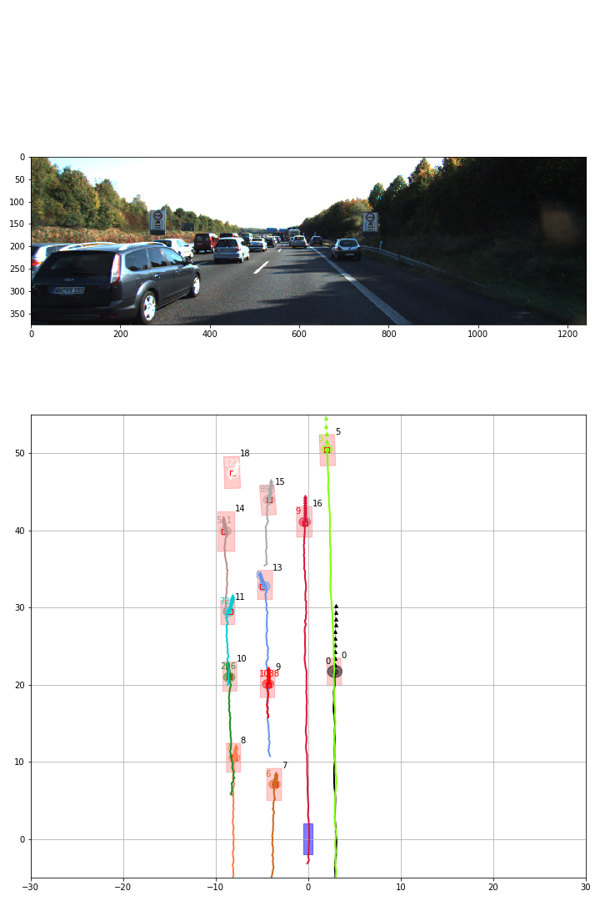

# Please note that this repository is not actively maintained.  

# PMBM 

This is the implementation of the Poisson Multi Bernoulli Mixture Filter
for the Master Thesis `Multi-Object Tracking using either Deep Learning or PMBM filtering` by Erik Bohnsack and Adam Lilja 
at Chalmers University of Technology, spring of 2019.

The implementation is done in Python 3.7 and it has only been tested on Ubuntu 16.04 and MacOS 10.13.6. 

## Requirements

`python 3.7` 

1. Get Murty-submodule `git submodule update`
1. Install Murty`pip3 install ./murty`
1. filterpy `pip3 install filterpy`
1. motmetrics `pip3 install motmetrics`
1. deap `pip3 install deap`  

## Results in gif-format

KITTI training sequence 20. Simulated object detections with noise, clutter and miss detections. 
Constant Acceleration motion model. 

KITTI training sequence 16. Simulated object detections with noise, clutter and miss detections. 
Constant Acceleration motion model.

## Run

Check `runforrest.ipynb`
